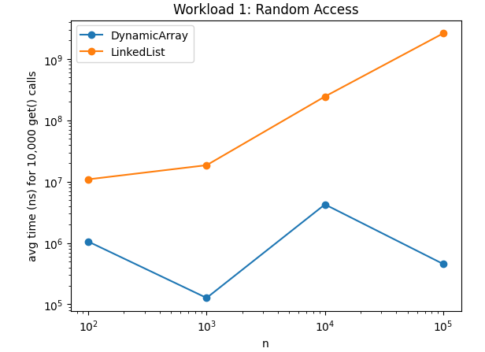
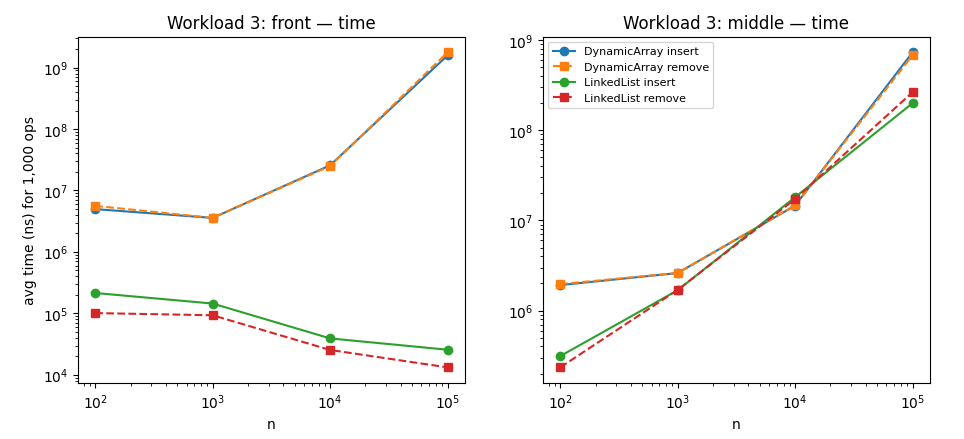
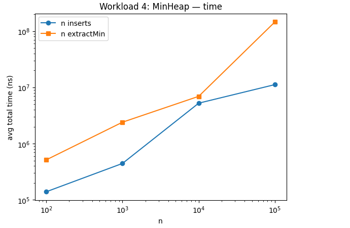

# Assignment 2 - Dynamic Array, Linked List, Min-Heap

## 1. Overview

Java implementation of three data structures: `DynamicArray`, `LinkedList` (singly linked), and `MinHeap` (binary min-heap). Each implements the core operations — `add`, `add(index, x)`, `remove(index)`, `get(index)`, `contains(x)` for the first two; `insert`, `peekMin`, `extractMin` for the heap. Each class also counts comparisons and movements so measured cost can be compared against theoretical complexity.

## 2. Complexity Analysis

| Structure | Operation | Best | Average | Worst | Aux. space |
|---|---|---|---|---|---|
| DynamicArray | add(x) | O(1) | O(1) amortized | O(n) on resize | O(1) amortized |
| DynamicArray | add(index, x) | O(1) at end | O(n) | O(n) at index 0 | O(1) |
| DynamicArray | remove(index) | O(1) at end | O(n) | O(n) at index 0 | O(1) |
| DynamicArray | get(index) | O(1) | O(1) | O(1) | O(1) |
| DynamicArray | contains(x) | O(1) | O(n) | O(n) | O(1) |
| LinkedList | add(x) (append) | O(1) | O(1) | O(1) | O(1) |
| LinkedList | add(index, x) | O(1) at head | O(n) | O(n) at tail | O(1) |
| LinkedList | remove(index) | O(1) at head | O(n) | O(n) at tail | O(1) |
| LinkedList | get(index) | O(1) at head | O(n) | O(n) at tail | O(1) |
| LinkedList | contains(x) | O(1) | O(n) | O(n) | O(1) |
| MinHeap | insert(x) | O(1) | O(log n) | O(log n) | O(1) |
| MinHeap | peekMin() | O(1) | O(1) | O(1) | O(1) |
| MinHeap | extractMin() | O(1) | O(log n) | O(log n) | O(1) |

**Notes**

- `get(index)` on `DynamicArray` is always O(1) — direct array access.
- `add(index, x)` / `remove(index)` on `DynamicArray` shift every element after `index`, so cost = `size - index`. Best case is at the end (0 shifts), worst case is at index 0 (n shifts).
- `LinkedList` is the opposite: indexed access walks links from the head, costing O(index). `add(x)` at the end is O(1) thanks to a tail pointer.
- `contains(x)` is a linear scan on both structures — same O(n), different constant factors (see Discussion).
- `insert`/`extractMin` on `MinHeap` touch at most one root-to-leaf path in a tree of height log(n), giving O(log n).

## 3. Correctness — Loop Invariant Proofs

### 3.1 `DynamicArray.add(int index, Object data)`

```java
for (int i = size; i > index; i--) {
    array[i] = array[i - 1];
}
array[index] = data;
```

- **Invariant:** before each iteration, positions `index..i-1` still hold their original values, and positions `i+1..size` already hold the value that used to be one position to their left.
- **Initialization:** before the first iteration `i = size`; the range `i+1..size` is empty (holds trivially), and `index..size-1` is untouched, matching the invariant.
- **Maintenance:** `array[i] = array[i-1]` copies the untouched value at `i-1` into `i`. After that, position `i` holds the shifted value and `i` decreases, so the invariant holds for the new `i`.
- **Termination:** the loop stops at `i = index`. By the invariant, `index+1..size` now holds the original values shifted right by one, and `index` itself was never touched — so `array[index] = data` inserts the new element without losing data. This is exactly what a correct insertion at `index` requires.

### 3.2 `MinHeap.siftDown`, used inside `extractMin`

```java
private void siftDown(int index) {
    while (true) {
        int left = index * 2 + 1;
        int right = index * 2 + 2;
        int smallest = index;
        if (left < size && compare(array[left], array[smallest]) < 0) smallest = left;
        if (right < size && compare(array[right], array[smallest]) < 0) smallest = right;
        if (smallest == index) break;
        swap(index, smallest);
        index = smallest;
    }
}
```

- **Invariant:** before each iteration, every subtree except the one rooted at the current `index` already satisfies the heap property.
- **Initialization:** before the first iteration `index = 0` (the root), which has no parent — the invariant holds trivially, since removing the old root only breaks the property at index 0.
- **Maintenance:** the loop finds the smallest among `index` and its children. If `smallest == index`, the property already holds and the loop breaks. Otherwise, swapping moves the smaller child up (now correct) and the larger value down into `smallest`, the new `index`. Every other subtree is untouched, so it stays valid.
- **Termination:** `index` moves strictly downward and tree height is `log(size)`, so the loop stops within O(log n) steps. At that point the whole array satisfies the min-heap property — exactly what `extractMin` needs.

## 4. Experimental Setup

- **n** (initial elements): 100, 1,000, 10,000, 100,000
- **m** (operations per workload): 10,000 `get()` calls (Workload 1) · 1,000 `contains()` calls (Workload 2) · 1,000 insertions + 1,000 removals at two positions (Workload 3) · n insert/extractMin calls (Workload 4)
- **Repetitions:** 5 runs per data point, average reported
- **Timing:** `System.nanoTime()` around the timed section only; input generation excluded
- **Random seed:** `new Random(42)` for the base dataset
- **Workloads:** Random Access, Search, Insertion/Removal (front & middle), Priority Processing — implemented in `src/Benchmark.java`

**To run:**
```bash
cd src
javac *.java
java Tests
java Benchmark
```
Benchmark writes CSV files to `results/csv/`.

## 5. Results

### Workload 1 - Random Access

| n | DynamicArray avg time (ns) | LinkedList avg time (ns) |
|---|---|---|
| 100 | 1,054,500 | 10,914,420 |
| 1,000 | 127,120 | 18,556,280 |
| 10,000 | 4,253,680 | 244,741,200 |
| 100,000 | 453,880 | 2,622,807,820 |

DynamicArray maintains roughly constant-time indexed access; LinkedList slows substantially as n grows.



### Workload 2 - Search

| n | DynamicArray avg time (ns) | LinkedList avg time (ns) | DynamicArray comparisons | LinkedList comparisons |
|---|---|---|---|---|
| 100 | 2,430,920 | 2,062,400 | 100,000 | 100,000 |
| 1,000 | 2,755,760 | 4,202,840 | 1,000,000 | 1,000,000 |
| 10,000 | 23,743,360 | 44,914,460 | 10,000,000 | 10,000,000 |
| 100,000 | 490,213,360 | 735,975,000 | 100,000,000 | 100,000,000 |

Comparison counts grow linearly with n for both structures, matching the theoretical O(n) search complexity.

### Workload 3 - Insertion and Removal

| n | Structure | Position | Insert (ns) | Remove (ns) |
|---|---|---|---|---|
| 100 | DynamicArray | Front | 4,979,880 | 5,621,220 |
| 100 | LinkedList | Front | 215,020 | 101,360 |
| 100 | DynamicArray | Middle | 1,918,640 | 1,966,360 |
| 100 | LinkedList | Middle | 312,660 | 234,480 |
| 1,000 | DynamicArray | Front | 3,578,600 | 3,586,240 |
| 1,000 | LinkedList | Front | 144,780 | 93,360 |
| 1,000 | DynamicArray | Middle | 2,609,940 | 2,614,220 |
| 1,000 | LinkedList | Middle | 1,683,440 | 1,696,700 |
| 10,000 | DynamicArray | Front | 25,676,520 | 25,031,200 |
| 10,000 | LinkedList | Front | 39,240 | 25,440 |
| 10,000 | DynamicArray | Middle | 14,584,660 | 14,682,940 |
| 10,000 | LinkedList | Middle | 18,101,400 | 17,252,740 |
| 100,000 | DynamicArray | Front | 1,574,981,040 | 1,766,355,880 |
| 100,000 | LinkedList | Front | 25,680 | 13,260 |
| 100,000 | DynamicArray | Middle | 731,679,100 | 679,223,140 |
| 100,000 | LinkedList | Middle | 199,697,760 | 264,210,160 |

Front-position operations strongly favor LinkedList (constant-time head insert/remove), while DynamicArray must shift many elements.




### Workload 4 — Priority Processing (MinHeap)

| n | Insert time (ns) | ExtractMin time (ns) | Insert comparisons | Extract comparisons | Order correct |
|---|---|---|---|---|---|
| 100 | 139,220 | 201,852 | 513,880 | 100,000 | true |
| 1,000 | 444,060 | 2,238 | 2,402,720 | 15,001 | true |
| 10,000 | 5,240,320 | 22,683 | 6,934,100 | 216,600 | true |
| 100,000 | 11,210,940 | 228,142 | 146,056,020 | 2,831,649 | true |

All extracted elements were in non-decreasing order, confirming the heap maintained the priority property.



## 6. Discussion

Results generally agree with the theoretical analysis. `DynamicArray.get()` stays effectively constant-time, while `LinkedList.get()` degrades as n grows. Search is O(n) for both, and the experiments show identical comparison counts, though running times differ due to implementation and memory-access overhead. Workload 3 follows the expected pattern: LinkedList is much faster at the front, both are linear in the middle — though similar O(n) behavior doesn't guarantee identical times: at n = 100,000, DynamicArray middle insertion took ~731.7 ms vs. ~199.7 ms for LinkedList. MinHeap cost grows with n as expected, and `order_ok = true` at every size confirms correct extraction order.

## 7. Design Recommendations

- **DynamicArray**  best for frequent indexed access: O(1) `get(index)` and contiguous memory layout.
- **LinkedList**  best when insertions/removals happen mostly at the front.
- **MinHeap**  best for priority-based processing: efficient min-access with logarithmic insert/extract.

## 8. Conclusion

Theoretical complexity is a useful predictor but doesn't fully determine real execution time. The three structures — contiguous array, linked nodes, heap — show clearly different practical trade-offs, and operations with the same asymptotic complexity can still differ noticeably in practice due to implementation details and constant factors. The right data structure depends on the operations performed most frequently.
